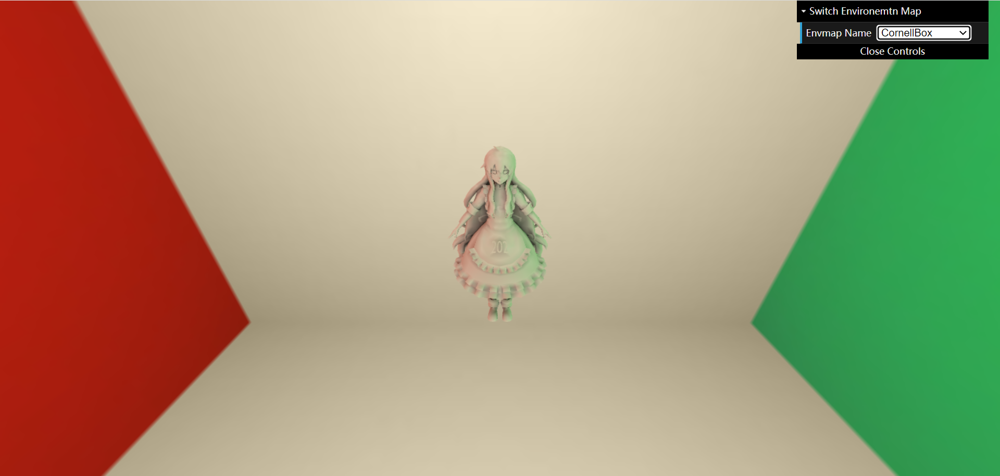
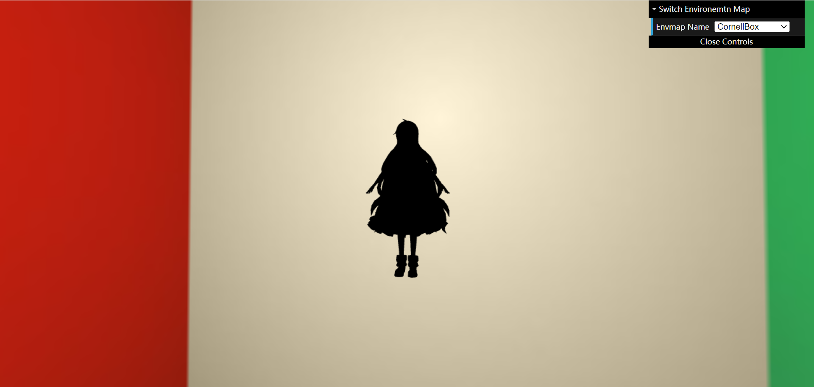
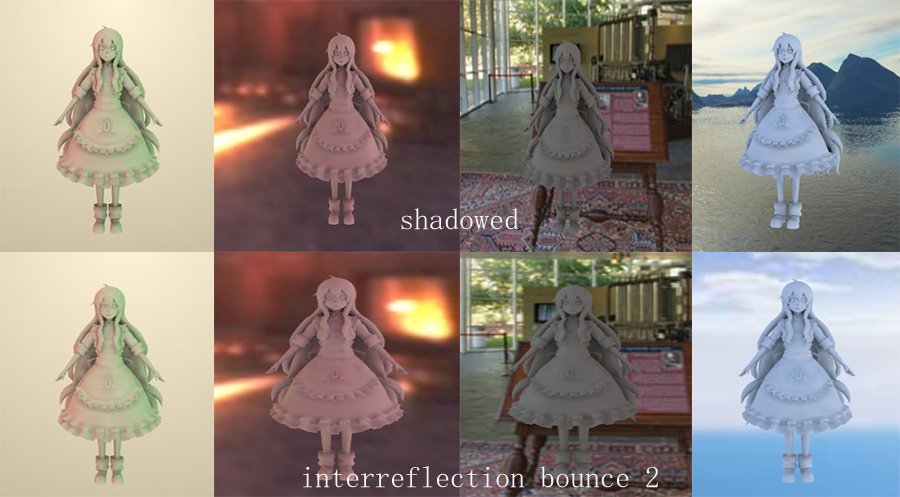

# Games202 homework2

- 预计算环境光投影到球谐函数上的对应的系数
- 预计算diffuse unshadowed情况的漫反射传输项球谐系数
- 预计算diffuse shadowed情况的漫反射传输项球谐系数
- 预计算diffuse inter-reflection情况的漫反射传输项球谐系数(Bonus 1)
- 实时球谐光照计算
- 环境光球谐旋转

## 模型纯黑问题

问题产生原因是vertexShader中未接受到PrecomputeL数据，注意PRTMaterial.js和WebGLRenderer.js以及shader中定义和更新的PrecomputeL大小写的一致性。

## inter-reflection情况

inter-reflection的球谐系数预计算非常慢，尤其是bounce次数高了之后更慢，bounce低了效果差别就会比较小。bounce一旦超过2次预计算就会很慢很慢了
可以明显看出interreflection情况下原本阴影的地方会更明亮一些。

