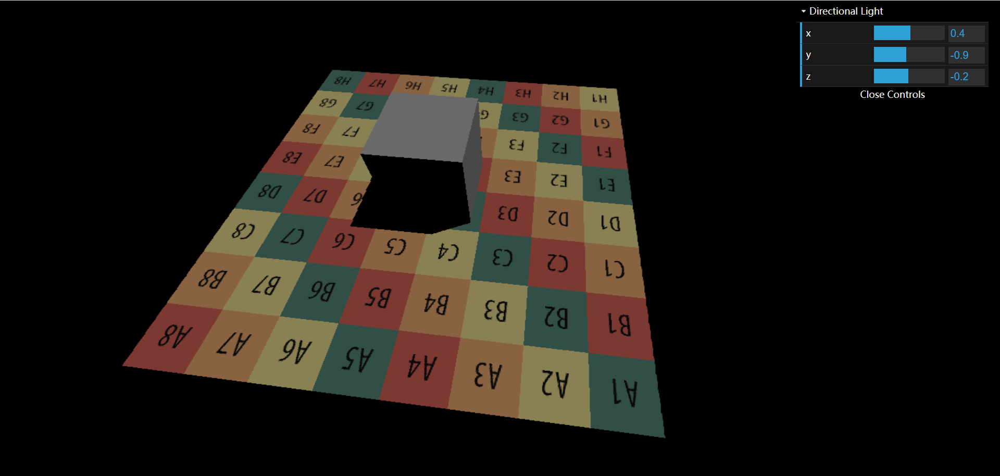
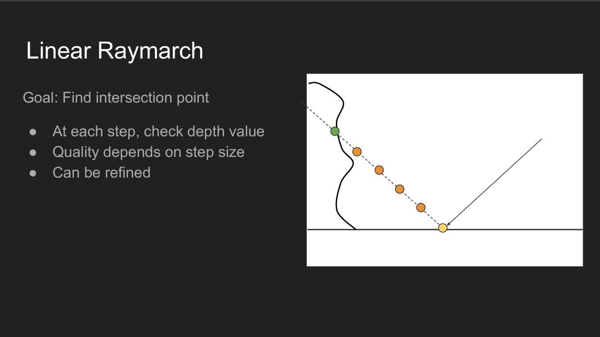
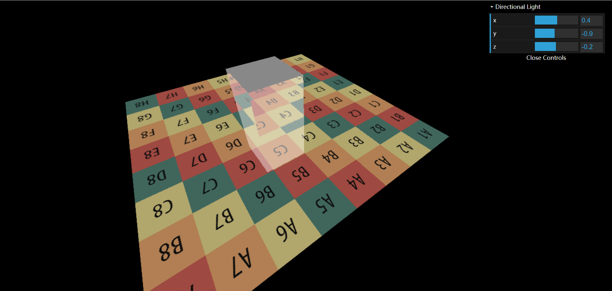
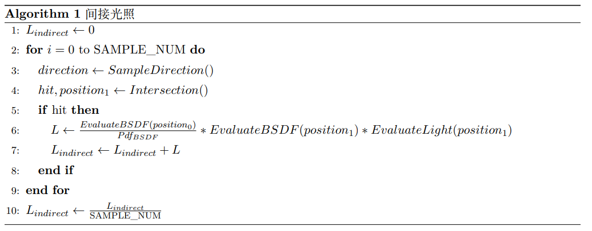
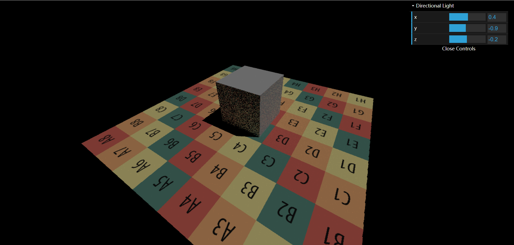
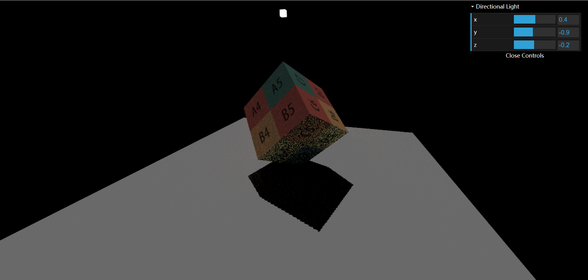
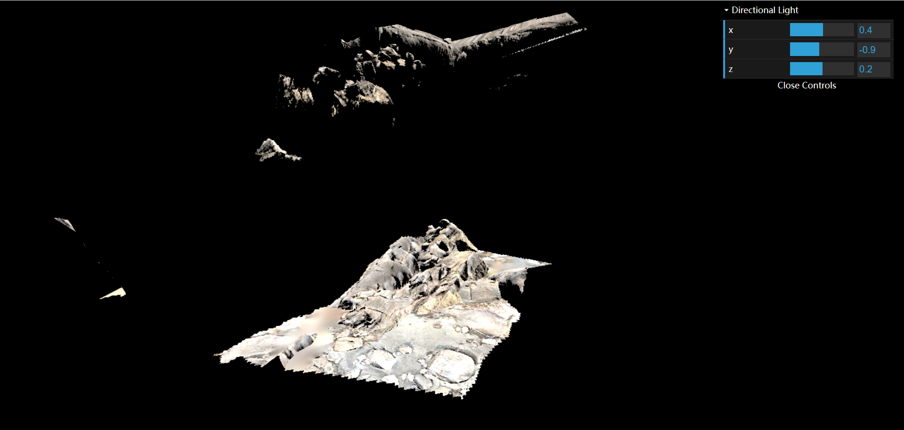
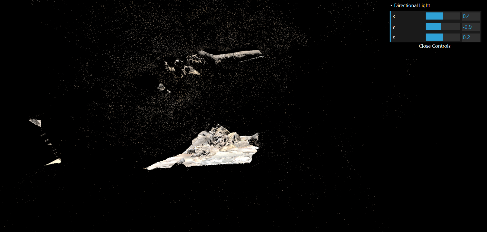
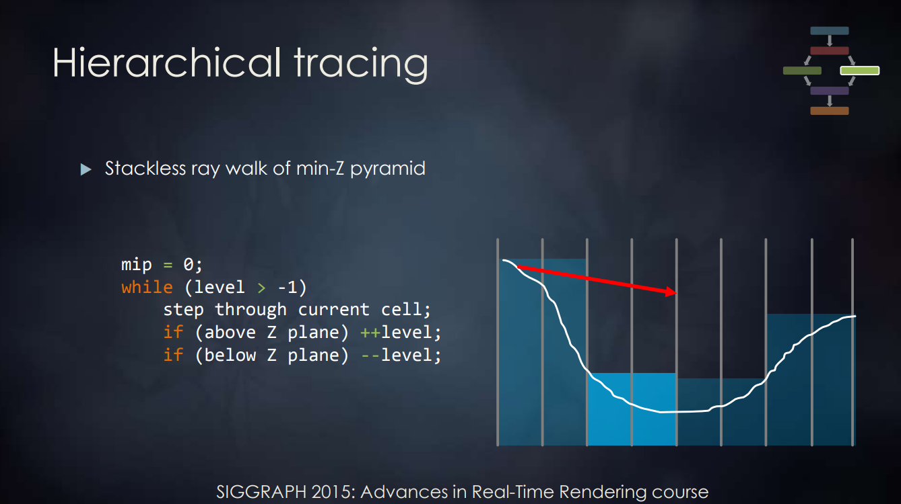

# 作业 3: Screen Space Ray Tracing

## 实现对场景直接光照的着色 (考虑阴影)

实现EvalDiffuse、EvalDirectionalLight和直接光照

## 实现屏幕空间下光线的求交 (SSR)

实现RayMarch并用镜面反射来验证正确性

## 实现对场景间接光照的着色

参考给出的伪代码实现间接光照

场景一，SAMPLE_NUM = 2

场景二，SAMPLE_NUM = 2

场景三，SAMPLE_NUM = 1(笔记本显卡拖不动了)

直接光照

间接光照

## 实现 Mipmap 优化的 Screen Space Ray Tracing

